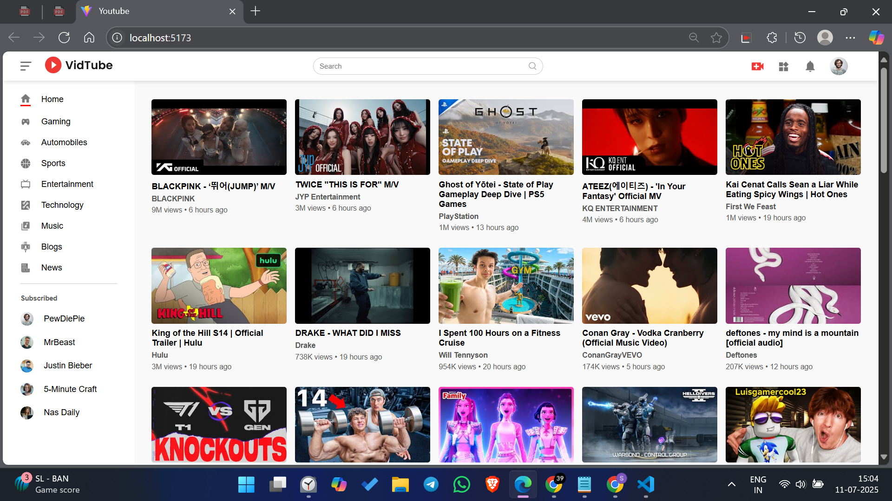
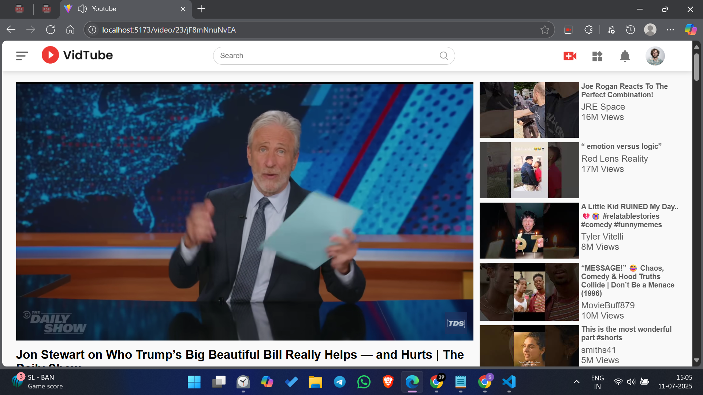

# 📺 YouTube Clone

A fully functional YouTube front-end clone built using **React**, **Tailwind CSS**, and **RapidAPI (YouTube v3 API)**. This project mimics the core features of YouTube, including video search, recommendations, and detailed video playback.

## 🚀 Features

- 🔍 Search for videos using YouTube Data API v3
- 🎬 Watch and explore related videos
- 🧭 Navigate across categories like Music, Gaming, Sports, etc.
- 🖥️ Responsive design optimized for all screen sizes
- ⚡ Fast UI with React functional components and hooks

## 🛠️ Tech Stack

- **Frontend:** React.js
- **Styling:** Tailwind CSS
- **Routing:** React Router DOM
- **Icons:** React Icons
- **API:** RapidAPI (YouTube Data API v3)

## 📸 Screenshots

| Home Page | Video Detail Page |
|-----------|-------------------|
|  |  |


## 🔧 Installation

1. **Clone the repository**
   ```bash
   git clone https://github.com/ShubhamKuttarmare25/Youtube-Clone.git
   cd Youtube-Clone
2.**Install dependencies**
      
    npm install

3. Get your API Key
Visit RapidAPI YouTube v3
Subscribe and get your API key
Create a .env file in the root directory and add:

VITE_REACT_APP_YOUTUBE_API_KEY=your_api_key_here

4. Run the application
   npm run dev


